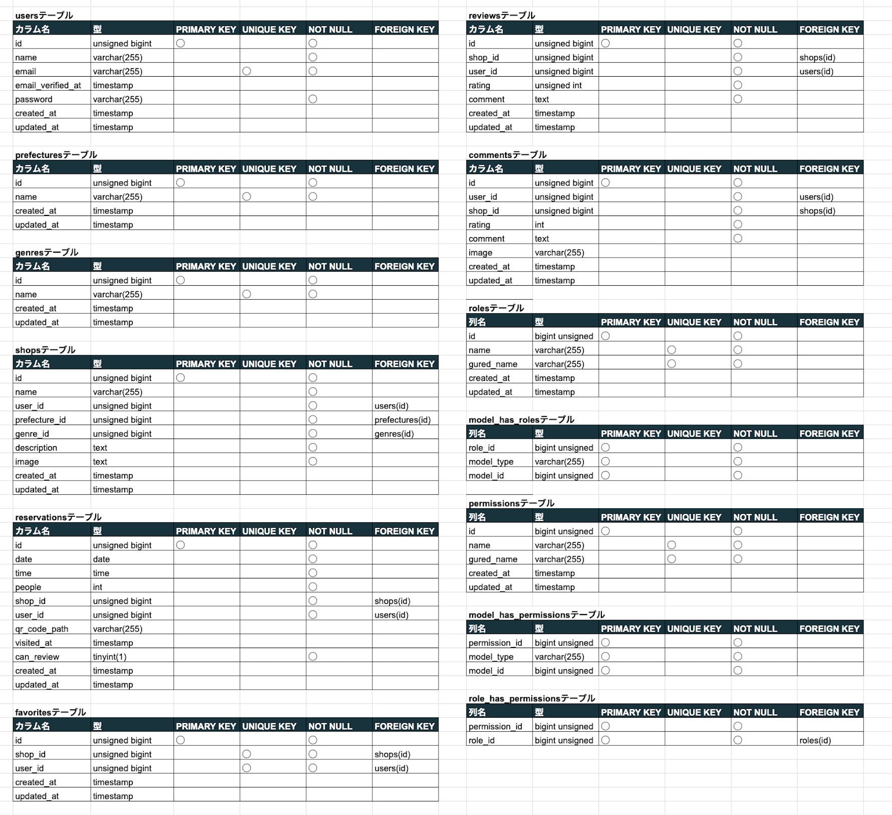
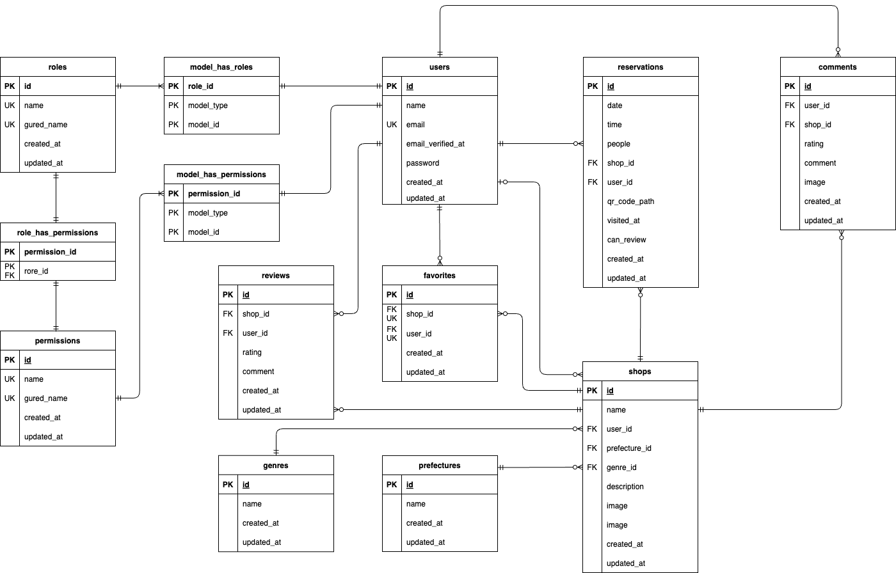

# Rese(リーズ)
## 概要説明

このアプリケーションは、飲食店の予約管理システムです。ユーザーは飲食店を検索し、予約を行い、評価やレビューを投稿できます。

## 作成した目的
- 本アプリケーションは、企業のグループ会社専用の飲食店予約サービスを提供することを目的としています。外部の飲食店予約サービスでは手数料が発生するため、企業として自社で予約サービスを構築することでコスト削減を図ります。初年度の目標として、ユーザー数10,000人を達成することを目指しています。
- 現在のサービスは機能や画面が複雑で使いづらいため、ターゲットユーザーである20〜30代の社会人がスムーズに利用できるように、シンプルで直感的なインターフェースを提供することにも重点を置いています。

## 機能一覧
- ユーザー関連
  - **会員登録**: 新しいユーザーがアカウントを作成し、サービスを利用開始できます。
  - **ログイン機能**: 登録済みのユーザーがアカウントにアクセスできます。
  - **ログアウト機能**: ユーザーが安全にアカウントからログアウトできます。
  - **メールアドレス認証(検証)**: ユーザーが登録時に確認メールのリンクをクリックすることで、アカウントが有効化され、ログインできるようになります。
  - **ユーザー情報習得**: ユーザーの基本情報を取得し、マイページにてお気に入り一覧と予約一覧を表示します。
  - **ユーザー飲食店お気に入り一覧習得**: ユーザーがお気に入りに追加した飲食店の一覧を取得します。
  - **ユーザー飲食店予約情報習得**: ユーザーが予約した飲食店の情報を取得します。
  - **飲食店一覧習得**: 利用可能な飲食店の一覧を表示します。
  - **飲食店詳細習得**: 特定の飲食店の詳細情報を表示します。
  - **検索機能(エリア・ジャンル・店名・キーワード)**: ユーザーが希望の飲食店を簡単に検索できます。
  - **飲食店お気に入り追加**: ユーザーが飲食店をお気に入りに追加できます。
  - **飲食店お気に入り削除**: ユーザーがお気に入りから飲食店を削除できます。
  - **飲食店予約情報追加**: ユーザーは飲食店の予約を行うことができます。
  - **飲食店予約情報削除**: ユーザーは飲食店の予約をキャンセルすることができます。
  - **飲食店予約情報更新**: ユーザーは既存の予約内容を変更することができます。
  - **店舗評価・コメント機能**: ユーザーが利用した飲食店に対して評価やコメントを投稿できます。
  - **Stripe決済機能**: ユーザーが飲食店の予約に対してオンラインで決済を行うことができます。
- 管理者関連
  - **店舗代表者登録**: 管理者は管理画面を通じて店舗代表者を登録できます。
  - **お知らせメール送信**: 管理者は管理画面からユーザーまたは店舗代表者にお知らせメールを送信できます。
- 店舗代表者関連
  - **店舗代表者メールアドレス認証(検証)**: 店舗代表者が受け取った確認メールのリンクをクリックすることで、アカウントが有効化され、ログインできるようになります。
  - **店舗情報作成**: 店舗代表者は管理画面から新しい店舗情報を作成できます。
  - **店舗情報更新**: 店舗代表者は登録した店舗情報を編集できます。
  - **店舗予約情報確認**: 店舗代表者は自店舗の予約状況を確認できます。
  - **QRコードによる来店確認機能**: 店舗代表者はQRコードを読み込んで予約した人の来店確認をすることができる。
- その他
  - **予約情報のリマインダーメール送信**: ユーザーに対して予約当日にリマインダーメールが自動で送信されます。
  - **未登録ユーザー向けのページ閲覧機能(飲食店一覧習得・飲食店詳細習得)**: 未登録のユーザーは、飲食店の一覧や詳細情報を閲覧することができます。これにより、アカウントを作成する前に、提供されているサービスや店舗情報を確認することができます。

## 操作方法
### ユーザー関連
以下の操作方法はログインを前提とした操作方法です。
- **予約について**
  - **予約の確認・変更・キャンセル**は、Mypageの予約状況から行うことができます。
    - **予約の変更**：「編集」ボタンをクリックして、表示される入力フォームに変更箇所を入力してください。変更が終わったら、必ず「更新」ボタンを押して確定してください。更新ボタンを押さないと変更は反映されません。変更をキャンセルする場合は、編集ボタンを再度押して編集モードを終了してください。
    - **予約のキャンセル**：各予約の右上にある「×」ボタンを押すことで、予約をキャンセルすることができます。
  - **飲食店の予約がある場合**、予約状況の「支払う」ボタンをクリックすると、Stripe決済機能を使って1,000円の支払いを行うことができます。この支払いは任意です。
  - **予約のQRコード**を来店時に店舗スタッフに提示することで、来店確認が行えます。
  - **来店確認後**、来店した店舗に対して評価とコメントを送信することができます。HOMEまたはお気に入り店舗の場合は、Mypageの店舗一覧より「詳しく見る」ボタンをクリックします。店舗の詳細ページで「レビューを書く」ボタンをクリックしてフォームを表示し、評価とコメントを入力して送信ボタンを押してください。レビューは、予約の来店確認ごとに1回のみ投稿できます。ただし、最新の来店確認が完了した時点で、過去の来店分のレビューを投稿していない場合はその分を含めた1回のみのレビュー投稿となります。次回の来店確認が完了するまでは、再度レビューを書くことはできません。送信前に「レビューを書く」ボタンを押すと、フォームが閉じて入力内容は破棄されます。

### 管理者関連
- **ロールとパーミッションについて**
  - システムでは、各ユーザーにロールが設定されており、ロールに応じて操作できる機能が異なります。
  - 主なロールには以下のものがあります：
    - admin（管理者）：管理者用の管理画面から、店舗代表者の登録やユーザーへのお知らせメールの送信が可能です。
    - store_manager（店舗代表者）：店舗代表者用の管理画面から、管理店舗の登録、管理店舗に関する情報の編集、予約の確認、来店者の来店確認が可能です。
    - user（ユーザー）：予約やレビューの作成が可能です。
  - 各ロールに割り当てられた操作権限（パーミッション）は、Spatie Laravel Permissionパッケージによって管理されています。
- **お知らせメール送信について**
  - メールは登録済みのユーザー、店舗代表者、管理者へ送信することができます。
  - 個別もしくは複数人に同時に送信可能です。個別選択を行い、CommandキーもしくはShiftキーを押しながら複数人を選択することで、同時に送信できます。
  - ロールごとにメールを送信することができます。
  - 個別選択とロールでの送信は、同時に選択して送信することはできません。
  - 「リロード」ボタンを押すと、現在の入力内容が消去されます。
- **予約リマインダーメールについて**
  - 毎朝8時に当日の予約があるユーザーに対して、予約確認のリマインダーメールを自動で送信する設定になっています。
  - **スケジュールの変更方法**：
    - スケジュールは `app/Console/Kernel.php` ファイルの中で設定されています。変更したい場合は、次のコードを編集してください：
```php
class Kernel extends ConsoleKernel
{
    /**
     * Define the application's command schedule.
     */
    protected function schedule(Schedule $schedule): void
    {
        $schedule->command('reminder:send')->dailyAt('8:00');
    }
}
```
- 上記のコードの dailyAt('8:00') の部分を変更することで、リマインダーメールの送信時間を調整することができます。

### 店舗代表者関連
- **店舗情報の登録について**
  - 登録できる画像はローカル画像または画像URLのいずれか一つのみです。登録後に別の画像を追加することはできませんので、どちらかを選択してください。
  - 「戻る」ボタンを押すと、現在の入力内容はクリアされ、登録店舗一覧画面に戻ります。
- **店舗情報の編集に関して**
  - 「編集」ボタンを押すと、該当店舗の登録情報を編集できます。
  - 「戻る」ボタンを押すと、現在の入力内容はクリアされ、登録店舗一覧画面に戻ります。
- **予約者の来店確認について**
  - 予約者の予約リストに表示されているQRコードを読み込んで、来店確認を行ってください。
- **iPhoneでのQRコード読み取りと認証確認について**
  - **概要**
    - iPhoneの標準カメラでQRコードを読み取ると、新しいタブで開かれるため、すでにログインしているセッションが引き継がれない場合があります。特に、店舗代表者がログインした状態でQRコードによる来店確認を行う際、次の方法でセッションを引き継いで確認が可能です。
  - **推奨手順**
    1. Chromeアプリを使用
    - iPhoneでQRコードを読み取る際に、Chromeアプリを使用することを推奨します。Chromeアプリはセッションを引き継ぎやすいため、スムーズな認証確認が期待できます。
      - Chromeアプリをインストール済みの場合:
        - Chromeアプリを開き、アドレスバーをタップし、「QRコード」を選択。
        - QRコードをスキャンすると、URLがChrome内で開かれます。
        - 読み取ったURLをタップし、ログイン状態のまま来店確認ができます。
    2. URLをコピーして既存のログイン済みブラウザに貼り付ける方法
    - もし標準カメラでQRコードを読み取る場合、以下の方法も有効です。
      - カメラアプリでQRコードをスキャンし、URLが表示されたら、URLをコピー。
      - すでにログイン状態のSafariやChromeのタブにURLを貼り付けてアクセスする。
  - **注意事項**
    - Safariでの新規タブ制限
      - SafariでQRコードを読み取った場合、新しいウィンドウで開くため、セッションが引き継がれないことがあります。この場合、上記手順を参照してください。
    - ログイン状態を保持するブラウザの使用
      - 特定のブラウザでログイン状態を保持したままアクセスした方が認証がスムーズになることがあるため、推奨手順に沿ったブラウザをご利用ください。

## 使用技術
- php 8.2.8
- Laravel 10.48.16
- mysql 8.0.37

## テーブル設計


## ER図


## 環境構築
### Dockerビルド
#### 1. `git clone git@github.com:mdrgreen39/rese.git`
#### 2. DockerDesktopアプリを立ち上げる
#### 3. `docker-compose up -d --build`

> *MacのM1・M2チップのPCの場合、`no matching manifest for linux/arm64/v8 in the manifest list entries`のメッセージが表示されビルドができないことがあります。
エラーが発生する場合は、docker-compose.ymlファイルの「mysql」内に「platform」の項目を追加で記載してください*
``` bash
mysql:
    platform: linux/x86_64(この文を追加)
    image: mysql:8.0.37
    environment:
```
> *Dockerコンテナをビルドした後に、vendor ディレクトリが生成されていないため、composer install を実行して依存関係をインストールする必要があります。queue-workerコンテナの`STATUS`が`Restarting`でもそのまま次の手順`composer install`を実行し、実行後に再度dockerコンテナの状態を確認してください。*

### Laravel環境構築
#### 1. `docker-compose exec php bash`
#### 2. `composer install`
#### 3. `.env.example`ファイルを `.env`ファイルに命名を変更。または、新しく`.env`ファイルを作成
- `.env`に以下の環境変数を追加
``` text
DB_CONNECTION=mysql
DB_HOST=mysql
DB_PORT=3306
DB_DATABASE=laravel_db
DB_USERNAME=laravel_user
DB_PASSWORD=laravel_pass
QUEUE_CONNECTION=database
LIVEWIRE_DEBUG=true           //追加
STORAGE_URL=http://localhost  //追加
```

#### 4. メール設定
メール送信に **Mailtrap** を使用します。以下の手順に従って設定してください。
  - Mailtrapの設定手順
     1. [Mailtrap公式サイト](https://mailtrap.io/)にアクセスし、アカウントを作成します。
     2. SMTP設定情報を取得します。
      - SMTP Settings タブををクリック
      - Integrations セレクトボックスで、Laravel 9+ を選択
      - copy ボタンをクリックして、クリップボードに .env の情報を保存
     3. mailtrap からコピーした情報を、プロジェクトの `.env` ファイルに貼り付ます。

```text
MAIL_DRIVER=smtp
MAIL_HOST=sandbox.smtp.mailtrap.io
MAIL_PORT=2525
MAIL_USERNAME=
MAIL_PASSWORD=
MAIL_ENCRYPTION=tls
MAIL_FROM_ADDRESS=    //送信元のメールアドレス
MAIL_FROM_NAME="${APP_NAME}"   //メールの送信者に表示される名前
```

#### 5. Stripe設定
決済機能としてStripeを使用します。以下の手順に従って設定してください。
  - Stripeの設定手順
    1. [Stripe公式サイト](https://stripe.com/jp)にアクセスし、アカウントを作成します。
    2. アカウントが作成できたら、ダッシュボードにログインします。
    3. 「開発者」セクションに移動し、テスト用のAPIキーを取得します。テスト用の公開可能キーとシークレットキーが表示されます。
    4. 環境変数（`.env`ファイル）に以下のようにAPIキーを設定します。
``` text
STRIPE_KEY=テスト用公開可能キー
STRIPE_SECRET=テスト用シークレットキー
```
 - Stripe公式テストカード一覧ページ : [Stripe Testing Cards](https://docs.stripe.com/testing)

#### 6. ストレージ設定
``` bash
php artisan storage:link
```
> *注意事項:
ローカル環境でのテスト時には、ファイルストレージのパーミッションに注意してください。適切に設定されていないと、QRコードの保存や読み込みが正常に行われないことがあります。*

**解決策**
  1. パーミッションの設定: 次のコマンドを実行して、`storage `ディレクトリのパーミッションを適切に設定してください。
``` bash
chmod -R 775 storage
```
  2. 所有者の確認: ストレージディレクトリの所有者がウェブサーバーのユーザー（通常は `www-data` や `nginx` など）になっているかを確認します。<br>
    確認するコマンド例：
``` bash
ls -la storage
```
> 出力例:`drwxrwxr-x  2 user group 4096 Oct 11 12:00 app`
   3. 問題が解決されない場合: 必要に応じて、サーバーの設定を見直し、適切なパーミッションが設定されているか再確認してください。

#### 7. 管理者の設定
1. `database/seeders/RolesAndPermissionsSeeder`ファイルを開いてください。
2. テスト用管理者を指定しています。変更の必要があればファイル内にある管理者の情報を設定してください。
```text
 // ローカル環境の管理者設定
$adminUser = User::firstOrCreate(
    ['email' => 'admin1@example.com'],  // 一意なメールアドレス
    [
        'name' => 'Admin Test User',    // 管理者の名前
        'password' => bcrypt('admin123'),     // 英数字8文字以上のパスワード
    ]
);
```

#### 8. アプリケーションキーの作成
``` bash
php artisan key:generate
```

#### 9. マイグレーションの実行
``` bash
php artisan migrate
```

#### 10. キューワーカーの再起動
``` bash
php artisan queue:restart
```

#### 11. シーディングの実行
``` bash
php artisan db:seed
```

## URL
- 開発環境:http://localhost/
- 開発環境のphpMyAdmin:http://localhost:8080/
- 開発環境でのメールテスト:http://localhost/test-email
- 本番環境 URL:http://57.180.31.85


## 他
- ローカル環境用に以下のユーザーが事前に設定されています。
>**7. 管理者の設定**で管理者を設定した場合はそちらを使用してください。
  - **管理者**
    - 名前：Admin Test User
    - メールアドレス: admin1@example.com
    - パスワード: admin123
    - ロール: admin
  - **店舗代表者**
    - 名前: Store Manager One
    - メールアドレス: store1@example.com
    - パスワード: store123
    - ロール: store_manager
  - **ユーザー**
    - 名前: User One
    - メールアドレス: user1@example.com
    - パスワード: user1234
    - ロール: user
- 本番環境用に以下のユーザーが事前に設定されています。
  - **管理者**
    - 名前：Admin Test User
    - メールアドレス: imakoko39+sub@gmail.com
    - パスワード: admin123
    - ロール: admin
  - **店舗代表者**
    - 名前: Store Manager One
    - メールアドレス: imakoko39+sub2@gmail.com
    - パスワード: store123
    - ロール: store_manager

